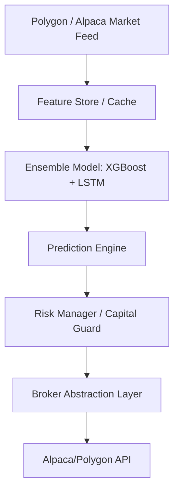
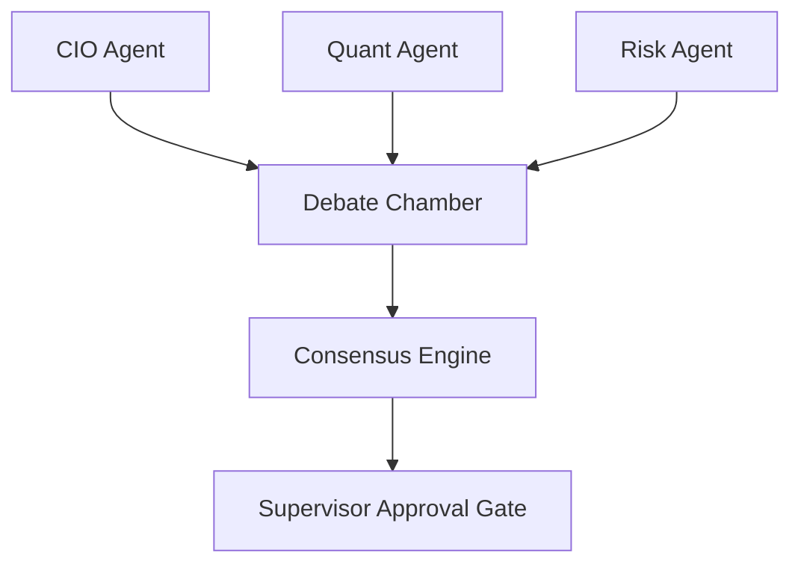
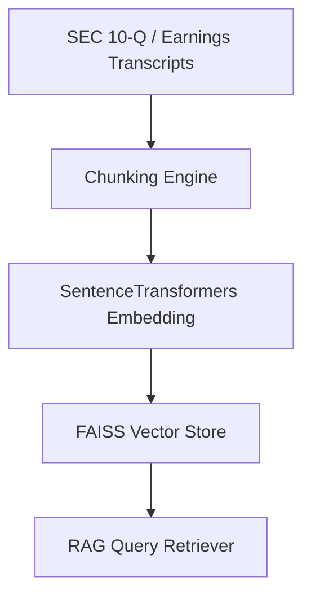

# AlphaForge AI System Architecture

This document maps out the system architecture and data pipelines for AlphaForge AI.

---

## 1. High-Level Data & Signal Flow

The diagram below outlines how market feeds flow into the feature stores, prediction engines, risk gates, and down to the broker execution layer.

---

## 2. Multi-Agent Collaboration Workflow

Specialized research agents negotiate allocation targets inside the debate chamber before final supervisor deployment approval.

---

## 3. RAG Research Architecture

Embeddings index generation flow across unstructured corporate text reports.

