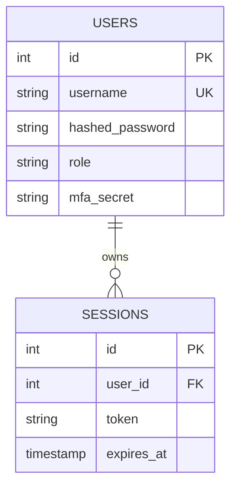

# AlphaForge AI Database Schemas

This document lists the database structures, tables, and relationships within AlphaForge AI.

---

## 1. User & Sessions (PostgreSQL / SQLite Relational Models)

---

## 2. Market Data & Time-Series (TimescaleDB / SQLite)

* **Table:** `ohlcv_ticks`
  * `timestamp` (TIMESTAMPTZ, Hypertable partitioning key)
  * `ticker` (VARCHAR(12))
  * `open` (NUMERIC)
  * `high` (NUMERIC)
  * `low` (NUMERIC)
  * `close` (NUMERIC)
  * `volume` (BIGINT)
  * **Index:** `idx_ticker_timestamp` (ticker, timestamp DESC)

---

## 3. Audit Trails & Logs
* **Table:** `audit_logs`
  * `id` (INTEGER PK)
  * `timestamp` (TIMESTAMPTZ)
  * `user_id` (INTEGER NULL)
  * `action` (VARCHAR(255))
  * `payload` (JSONB)
